# 即梦素材一键匹配 · 使用说明

适用版本：**v0.3.20**。截图来自 Chrome 中的即梦真实页面，使用 **Seedance 2.5 → 全能参考**；前版操作截图同样适用。

**提示词里写 `@素材名` → 自动上传 → 等素材就绪 → 自动匹配。** 图片、视频、音频均可从同一个根文件夹自动上传，支持子文件夹。

插件保留原文字，在后面添加网页原生参考标签。上传和匹配分别点击，生成任务由你自己提交。

## 1. 安装或更新

1. 下载并解压插件。
2. Chrome 打开 `chrome://extensions/`；Edge 打开 `edge://extensions/`。
3. 开启「开发者模式」，点击「加载未打包的扩展程序」或「加载已解压的扩展程序」。
4. 选择**直接包含 `manifest.json`** 的文件夹，回到即梦页面刷新。

更新时，将新版文件放入原安装目录，点击扩展的「重新加载」，再刷新即梦。刷新前保存提示词；避免同时启用多个版本或旧油猴脚本。首次出现说明时点击「开始使用」。

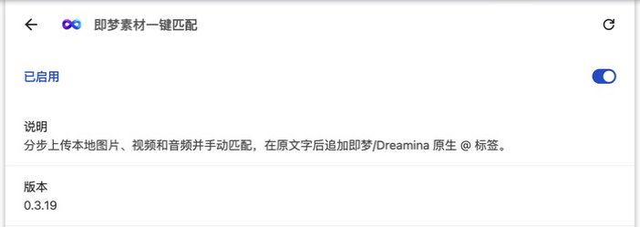

## 2. 用两张图跑一遍

项目自带两张 AI 生成的演示图。下载并解压项目后，素材目录是 **`examples/quick-start/images`**；也可分别下载下表原图，放进同一个文件夹。

| 产品参考 | 场景参考 |
| --- | --- |
| 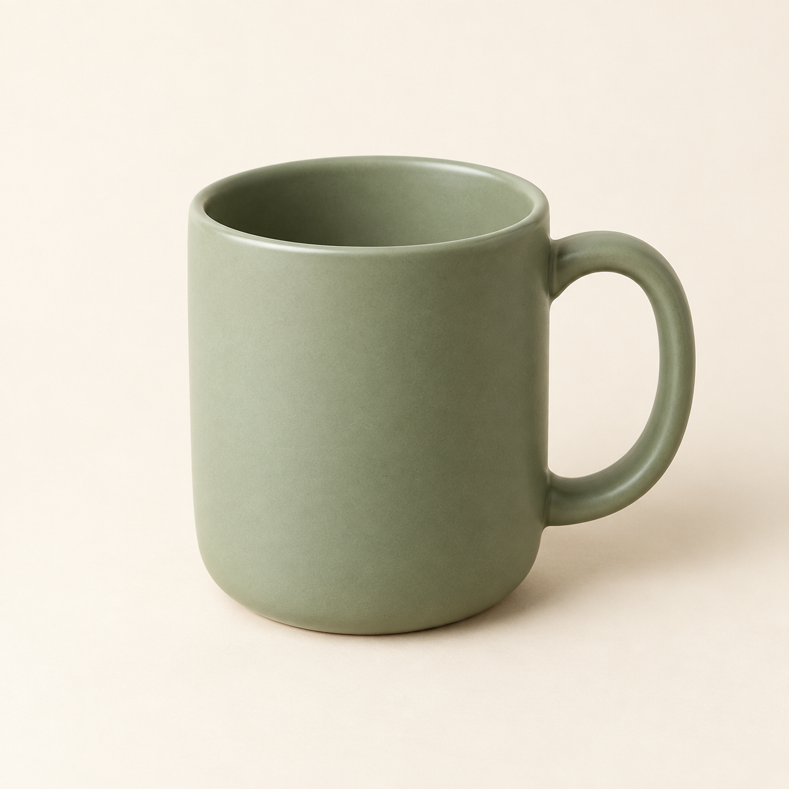 |  |
| [产品_绿杯.png](examples/quick-start/images/产品_绿杯.png) | [场景_窗边.png](examples/quick-start/images/场景_窗边.png) |

### 第一步：写提示词

在即梦创作页，将创作类型切换为**视频生成**，选择 **Seedance 2.5 → 全能参考**，粘贴：

```text
产品外观参考 @产品_绿杯，环境参考 @场景_窗边。
把绿杯放在窗边木桌中央，杯子保持静止。
镜头缓慢推进，最后停在杯口与把手的细节。
自然晨光，保持杯子形状与颜色一致，不出现字幕或水印。
```

「待匹配 2」表示两处文字引用还没有绑定素材。

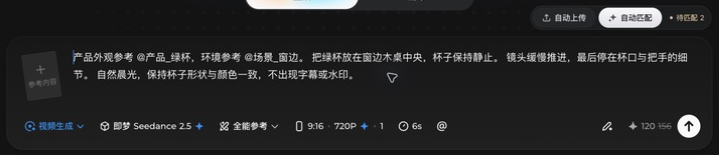

### 第二步：自动上传

点击输入框右上方的**自动上传**，选择刚才的 `images` 文件夹。浏览器询问访问权限时，确认目录后允许访问。

等上传结束、缩略图就绪。多张图片可能叠成一张卡片；这时还没绑定标签，显示「待匹配」是正常的。

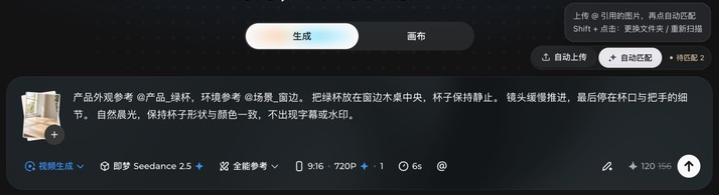

### 第三步：自动匹配

点击**自动匹配**，等待结束。素材菜单会短暂打开、关闭，期间先不要改字或切换节点。

确认两点即可：

- 每处 `@素材名` 后都有对应的**原生标签**，原来的文字仍在。
- 右上角显示**已匹配**。

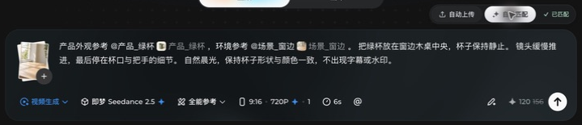

现在可自行设置比例、时长、分辨率并生成。只体验插件，到这里就完成了；「已匹配」表示引用绑定成功。

## 3. 提示词怎么写

**半角 `@` + 完整文件名（不含扩展名）**。引用后用逗号、句号、空格或换行隔开正文。

| 文件名 | 正确写法 | 常见错误 |
| --- | --- | --- |
| `产品_绿杯.png` | `@产品_绿杯` | `@绿杯`（简称） |
| `场景_窗边.png` | `@场景_窗边` | `@场景_窗边.png`（带扩展名） |
| `角色_正面.jpg` | `@角色_正面` | `＠角色_正面`、`@ 角色_正面`、`@@角色_正面` |
| `镜头 跟随.mp4` | `@镜头 跟随，` | `@跟随`（简称） |
| `音频_010.wav` | `@音频_010，` | `@音频_01`（另一个名字） |

- 文件名尽量短、唯一。不同子目录、不同扩展名的同名素材都可能冲突。
- 只上传精确引用的素材，不猜简称或相似名称。同一素材多次引用只上传一份，每处引用分别匹配。
- 已手动上传的素材，以网页原生素材菜单里的完整名称为准，可直接点击「自动匹配」。

正文按 **参考用途 → 动作顺序 → 镜头 → 一致性要求** 写。每张图说清用途，短视频安排一组动作，镜头保留一个主要运动。

让 AI 帮你写时，可复制下面这段，替换素材名和视频想法：

```text
请帮我写一段简短的即梦视频提示词。
素材文件：产品_绿杯.png、场景_窗边.png。
视频想法：绿杯放在窗边木桌上，镜头缓慢推进，展示杯口和把手。
用 @完整文件名 引用素材，不带扩展名，不改名、不用简称，引用后加标点。
写清每张参考图的用途、动作顺序、镜头和需要保持一致的细节。
只输出可以直接粘贴的提示词。
```

### 文件名里有空格怎么办？

**名称内部的空格可以保留，`@` 后不能先加空格。** 本次以下三组均已实际上传、匹配成功：

| 文件名 | 提示词写法 |
| --- | --- |
| `角色 正面.png` | `@角色 正面，` |
| `scene morning.png` | `@scene morning，` |
| `道具  背包.png`（两个空格） | `@道具  背包，` |

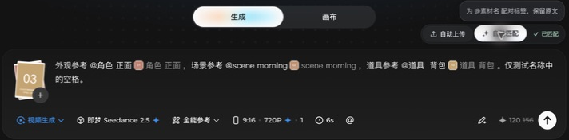

引用结束后加逗号或换行，避免和后面的句子混在一起。网页标签可能把连续空格显示成一个空格，原提示词会保留。

**不要只靠空格数量区分两个文件**：`同名 测试.png` 与 `同名  测试.png` 会冲突，插件会停止上传。改为 `同名_正面.png`、`同名_侧面.png` 等唯一名称，再用 **Shift + 点击自动上传**重新扫描。

如果其他页面上传后改变了显示名称，以原生 `@` 菜单中的名称为准；自动上传前统一改成下划线也可以。[空格测试文件与冲突截图](examples/space-names/README.md)

## 4. 背景音乐开关

提示词下方，**原生 `@` 右边的音符按钮**控制背景音乐提示。

- **默认关闭**：音符带斜线；写好提示词后，自动在**开头**补上「不需要背景音乐」。
- **点击开启**：音符的斜线消失，移除本次由插件补上的句子。
- 再次关闭会重新补上，不重复添加。原有正文和素材标签保留；空提示词不自动填字。
- 你自己写的「不需要背景音乐」不会被开关删除。如需开启音乐，请同时检查正文里是否还有手写要求。

按钮与 `@` 在同一工具栏排列，随工具栏移动和缩放；点击沿用果冻回弹效果。每个编辑器默认关闭，刷新后恢复默认状态。开关通过提示词表达要求，实际声音以模型输出为准。

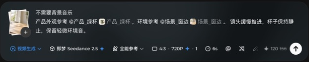

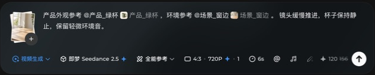

## 5. 界面深浅色

在网页头像菜单中选择**浅色模式 / 深色模式**，插件界面会立即跟随，**无需刷新或单独设置**。

自动上传、自动匹配、状态文字、提示卡、弹窗和音乐按钮一起换色；按钮位置、尺寸与果冻动效保持一致。音乐关闭时，浅色页面也能看清带斜线的音符。

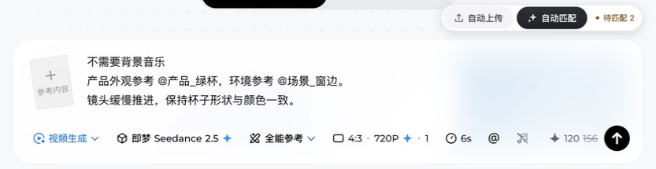

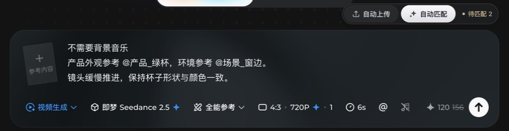

## 6. 无限画布怎么用

1. 添加或选中一个**视频节点**，点击它的提示词区域。
2. 在**当前节点**选择 **Seedance 2.5 → 全能参考**。
3. 写提示词 → **自动上传 → 自动匹配**，检查原文和标签。

按钮跟随当前活动节点，每个视频节点单独处理素材。匹配结束后再切换节点。

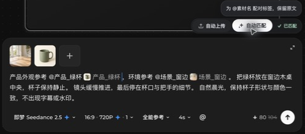

## 7. 多素材怎么用

Seedance 2.5 官方上限为 **30 张图片 + 10 段视频 + 10 段音频，共 50 项**。50 是各类素材的总数，纯图片最多 30 张。[官方说明](https://seed.bytedance.com/en/blog/one-take-creation-flexible-referencing-introducing-seedance-2-5)

**先确认模型，国际版的 2.0 和 2.5 上限不同：**

| 全能 / 全方位参考模式 | 图片 | 视频 | 音频 | 总数 |
| --- | --- | --- | --- | --- |
| Seedance 2.5 | 30 | 10 | 10 | 50 |
| Dreamina Seedance 2.0 | 9 | 3 | 3 | 12 |

各类上限和总数上限须**同时满足**。2.0 的分项相加虽为 15，总数仍不能超过 12。[Dreamina 2.0 官方说明](https://dreamina.capcut.com/tools/seedance-2-0)

国际版参考模式也可能显示为「全方位參考」或「Omni reference」。50 素材测试请选择 **Seedance 2.5**；2.0 只能上传较少素材，不代表上传功能失效。插件对识别到的上述模型预检数量，其他模式以网页提示为准。

**图片、视频、音频都可用「自动上传」。** 选择包含三类素材的**根文件夹**，不要只选择图片子目录。v0.3.17 已用十段长提示词实测：一次提交 **30 图 + 10 视频 + 10 音频**，再点击一次「自动匹配」，页面显示「已匹配」。

直接使用 [50 素材测试文件](examples/mixed-names/README.md) 和 [完整提示词](examples/mixed-names/prompt-50.txt)，选择 `examples/mixed-names/materials` 文件夹即可。

```text
外观参考 @角色 正面，场景参考 @scene morning。
运动节奏参考 @镜头 跟随，声音起落参考 @音频_010。
镜头沿桌面缓慢推进，保持主体外观与空间位置一致。
```

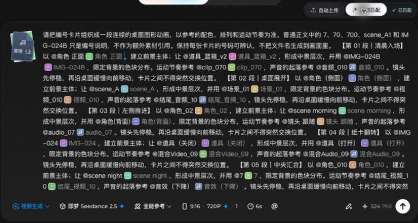

常用格式：图片 PNG/JPG/WebP，视频 MP4/MOV/WebM/M4V，音频 WAV/MP3/AAC/M4A。格式、大小、分辨率和时长仍以网页要求为准；本次混合上传实测使用 PNG、MP4、WAV。

**附件数量与引用次数分开计算**：同一素材可以在提示词中引用多次，每处都会添加标签；插件没有每轮 30 处或 50 处的匹配上限。不要把 `@测试图_01 到 30` 当成三十处引用，名称需要逐个写全。

完整编号素材、可复制提示词、实际接收数量与匹配结果见 **[多素材使用与测试](docs/MULTI_ASSET_GUIDE.md)**。

## 8. 常见问题

| 情况 | 怎么处理 |
| --- | --- |
| 看不到按钮 | 刷新即梦，点击视频提示词框，确认「全能参考」和扩展已启用。 |
| 找不到同名图片 / 同名冲突 | 检查名称和目录；改为唯一名称后，用 **Shift + 点击自动上传**重新扫描。 |
| 只上传了图片，视频和音频没上传 | 确认已更新到 **v0.3.17 或更高版本** 并重载、刷新；选择包含三类文件的根目录。旧页面已有附件时，先匹配核对，再用 **Shift + 点击自动上传**重选根目录补传。 |
| 上传后仍待匹配 | 等缩略图就绪，再点「自动匹配」。 |
| 等待网页确认 / 素材菜单不可用 | 等页面稳定，确认网页自己的 `@` 菜单能打开后再匹配，避免连续重传。 |
| 新增引用 / 更换文件夹 | 改提示词 → 上传 → 匹配。换目录或目录里新加文件时，用 **Shift + 点击自动上传**重选、重扫。 |
| 刷新后要重选目录 | 正常，目录仅在当前页面会话保留。原附件若还在，先匹配核对，再按需补传。 |
| 删了部分附件，要补回来 | 先匹配核对剩余素材，再上传补缺，最后重新匹配。 |
| 提示内容变化、错位或重复标签 | 等操作停止，检查并手动整理原文、标签后再匹配。 |
| 素材超限 / 国际版只能上传少量素材 | 检查实际选中的是 2.0 还是 2.5；50 素材示例需使用 2.5 的全方位参考模式。仍需满足各类数量、总数和网页要求。 |
| 切换浅色后插件仍是深色 | 确认已更新到 v0.3.20，在扩展管理页重新加载，再刷新已有创作页。之后切换主题无需刷新。 |

本插件为非官方开源辅助工具。本文实测覆盖上传和引用匹配，未提交视频生成任务；Dreamina 和其他模型组合未在本次实测。

[隐私说明](PRIVACY.md) · [免责声明](DISCLAIMER.md) · [示例素材说明](examples/quick-start/README.md)
