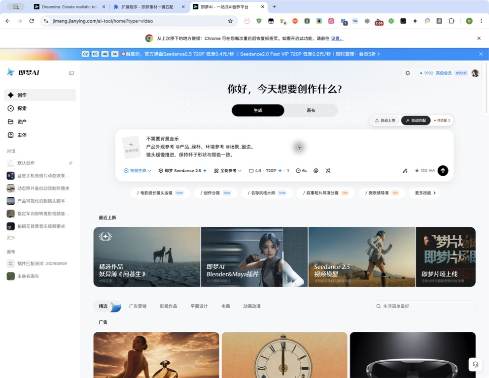
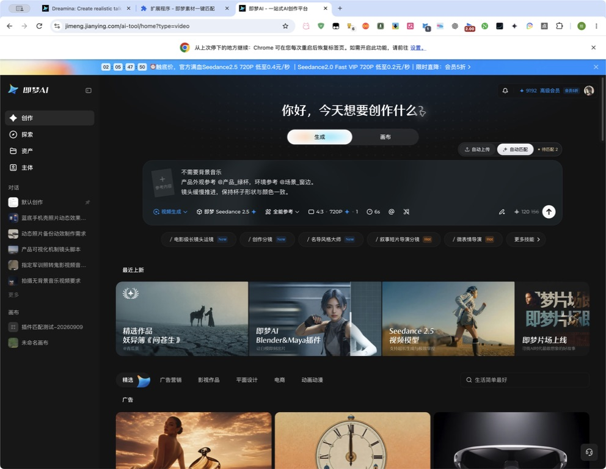
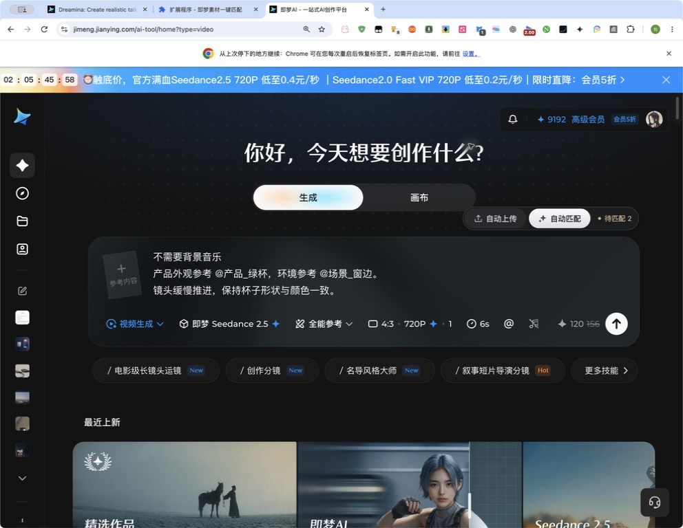
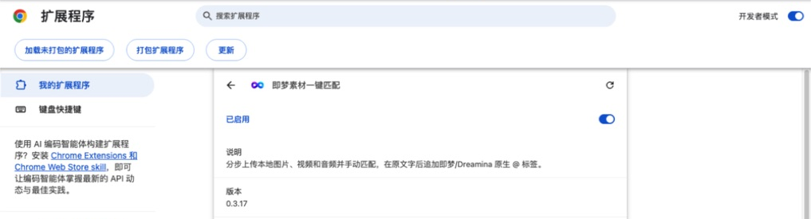
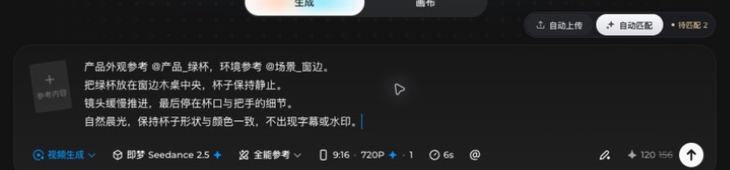
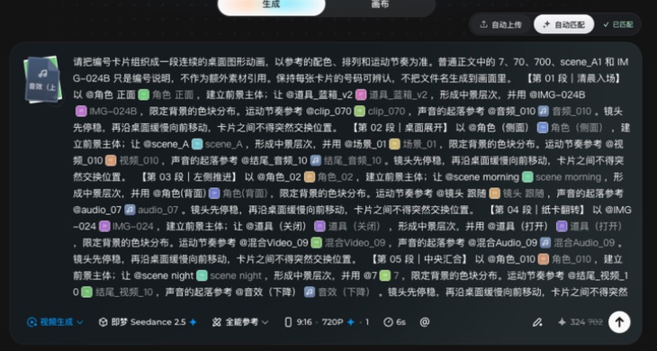
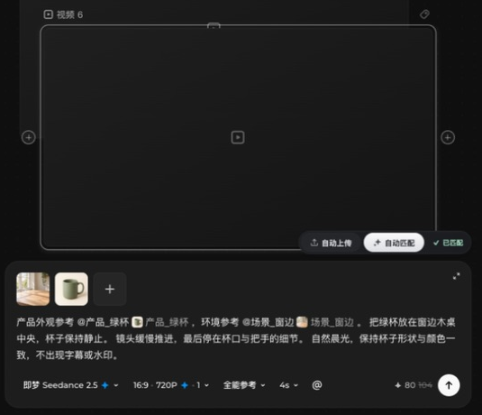
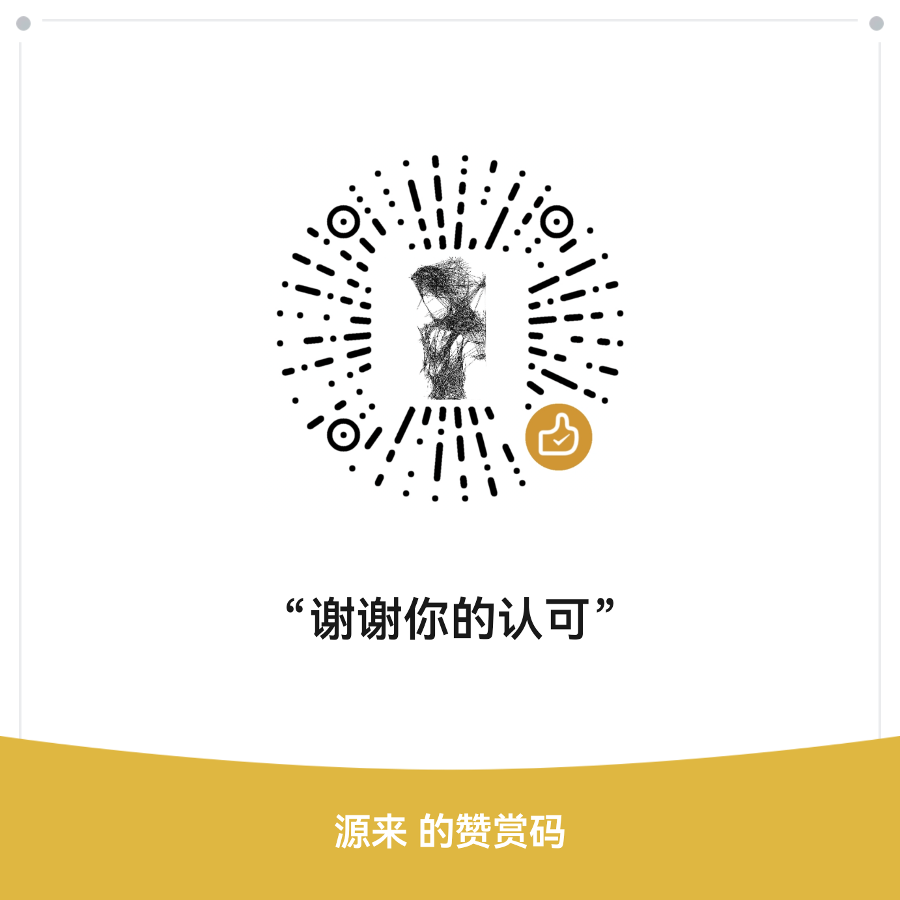

# 即梦素材一键匹配 · 使用说明

**v0.3.21 · Chrome / Edge 浏览器扩展 · MIT 开源**

根据提示词中的 `@素材名`，从本地文件夹自动上传对应的图片、视频和音频，再把网页原生素材标签添加到原文字后面。支持即梦普通创作页和无限画布。

**写提示词 → 自动上传 → 等素材就绪 → 自动匹配 → 检查后自行生成。**

## v0.3.21 · 修复画布自动匹配

- 兼容新版画布的图片、视频、音频原生候选缩略图标记，修复菜单中存在素材却匹配不到的问题。
- 匹配前等待画布富文本回写稳定，再定位引用光标，避免连续匹配时菜单意外关闭或插入中断。
- 保留精确名称匹配、原文和原生标签校验；普通创作页保持原有触发流程。
- 同步扩展、Agent 安装包版本和文件校验清单，并补充候选识别及异步回写回归测试。

## v0.3.19 · 跟随网页深浅色

工具条、提示卡、弹窗和背景音乐按钮会自动跟随网页浅色 / 深色模式切换，无需刷新；控件尺寸、间距和果冻点击动效保持不变。







## 下载

| 下载内容 | 用途 |
| --- | --- |
| **[插件安装包](https://github.com/yuanlai-233/jimeng-asset-matcher/releases/download/v0.3.21/jimeng-asset-matcher-v0.3.21.zip)** | 推荐下载。只包含运行程序、图标和许可证，解压即可加载。 |
| [Skill 与源码包](https://github.com/yuanlai-233/jimeng-asset-matcher/releases/download/v0.3.21/jimeng-asset-matcher-skill-v0.3.21.zip) | 可由 Agent 自动安装的 Skill、安装脚本与完整扩展源码。 |

这套 Skill 不包含测试图片、测试视频、测试音频、样例提示词或验收产物。使用时选择自己的素材目录。

## 安装与更新

1. 下载并解压插件安装包，把解压后的文件夹放到一个固定位置。
2. Chrome 地址栏输入 `chrome://extensions/`；Edge 输入 `edge://extensions/`。
3. 开启右上角的 **开发者模式**，点击 **加载未打包的扩展程序**（部分浏览器显示“加载已解压的扩展程序”）。
4. 选择**直接包含 `manifest.json`** 的文件夹，不要选择 ZIP 文件或外层空目录。
5. 回到即梦并刷新页面，点击视频提示词框。首次出现说明时，点击 **开始使用**。



更新时，用新版覆盖原安装文件夹，点击扩展的 **重新加载**，再刷新即梦。刷新前先复制保存提示词。只启用一个版本；如果还装着旧油猴脚本，请先停用。安装后保留该文件夹，浏览器需要从这里读取程序。

## 开始使用

### 1. 准备素材和提示词

打开 [即梦](https://jimeng.jianying.com/)，进入 **视频生成**，选择支持参考素材的模型和 **全能参考** 模式。下方截图使用即梦 Seedance 2.5。

将需要使用的素材放在同一个文件夹中，也可以分成图片、视频、音频等子文件夹。

提示词用 **半角 `@` + 完整文件名（不含扩展名）** 引用素材。例如有 `产品_绿杯.png` 和 `场景_窗边.png`，可以粘贴：

```text
产品外观参考 @产品_绿杯，环境参考 @场景_窗边。
把绿杯放在窗边木桌中央，杯子保持静止。
镜头缓慢推进，最后停在杯口与把手的细节。
自然晨光，保持杯子形状与颜色一致，不出现字幕或水印。
```



### 2. 自动上传

点击提示词框右上方的 **自动上传**，选择素材文件夹。浏览器询问访问权限时，确认选择的目录后允许访问。

插件会查找该文件夹及其子文件夹，只上传提示词中明确引用的素材。同一文件引用多次，只上传一份。等网页里的素材缩略图或上传提示稳定后，再进行下一步；多张素材有时会叠成一张卡片。

**上传完成后仍显示“待匹配”是正常的，上传和匹配需要分别点击。**

### 3. 自动匹配

点击 **自动匹配**。素材菜单会短暂打开、关闭，等待操作结束后再改字或切换节点。

完成后检查：

- 每处 `@素材名` 原文字后，都有对应的网页原生素材标签。
- 右上角显示绿色 **已匹配**。
- 原来的提示词文字保留，标签紧接在引用后面；这是正常结果。



确认后，自行设置比例、时长等参数并生成。插件在点击发送或按 Enter 时会弹出确认；`Shift + Enter` 用于换行。“已匹配”表示素材引用绑定完成。

**如果素材已经手动上传：** 按网页 `@` 素菜单里的完整名称写提示词，直接点击 **自动匹配** 即可。

## 素材名称怎么写

| 文件名 | 提示词写法 |
| --- | --- |
| `产品_绿杯.png` | `@产品_绿杯，` |
| `角色（正面）.jpg` | `@角色（正面），` |
| `scene morning.png` | `@scene morning，` |
| `镜头 跟随.mp4` | `@镜头 跟随，` |
| `音频_010.wav` | `@音频_010。` |

- 名称必须完整，不使用简称；`@道具_红杯` 与 `@道具_红杯盖` 是两个名称。
- 不写扩展名，不写全角 `＠`，不写 `@@名称`，也不要在 `@` 后先加空格。
- 名称内部的空格、括号可以保留，引用后建议加逗号、句号或换行。
- 不同文件使用不同名称。不同子目录中同名、不同扩展名但去掉扩展名后同名，都可能冲突；不要只靠连续空格的数量区分文件。
- 如果网页上传后改变了显示名称，以网页原生 `@` 菜单为准。
- 同一素材可在提示词中重复引用，每处分别添加标签。普通正文里不带 `@` 的名称和数字不参与匹配。

## 无限画布

1. 打开即梦无限画布，添加或选中一个 **视频节点**。
2. 点击该节点的提示词框，选择支持参考素材的模型及 **全能参考**。
3. 写提示词，依次点击 **自动上传 → 自动匹配**。
4. 检查标签与“已匹配”状态，完成后再切换其他节点。



每个节点分别处理素材，按钮跟随当前活动的提示词框。

## 视频、音频与批量素材

图片、视频和音频可以放在同一个根文件夹下。点击 **自动上传** 时选择包含三类素材的根文件夹，不要只选图片子目录。

常用格式包括图片 PNG / JPG / WebP、视频 MP4 / MOV / WebM / M4V、音频 WAV / MP3 / AAC / M4A。数量、大小、编码和时长要求以当前模型及网页提示为准。

## 常见问题

| 情况 | 处理方法 |
| --- | --- |
| 看不到按钮 | 确认扩展已启用，刷新网页，进入视频生成并点击提示词框。 |
| 找不到素材 | 检查完整名称、所选文件夹和文件类型；已上传的素材以网页菜单中的名称为准。 |
| 提示同名冲突 | 给冲突文件改成不同名称，再按住 **Shift 点击自动上传**，重新选择或扫描目录。 |
| 换文件夹或新增了本地文件 | 按住 **Shift 点击自动上传**，重新选择或扫描。 |
| 刷新后要重选目录 | 正常，目录授权与索引仅保留在当前页面会话。已有附件时先匹配核对，再按需补传。 |
| 上传后仍是黄色 | 等上传完成，再点自动匹配；按提示检查缺失素材或确认是否保留未引用素材。 |
| 等待网页确认、素材菜单不可用 | 等页面稳定，确认网页自己的 `@` 菜单能看到素材后再匹配，避免连续重传。 |
| 删除了部分附件，需要补传 | 先匹配核对剩余素材，再自动上传补缺，最后重新匹配。全部删空时建议重新开始任务。 |
| 提示标签错位、重复或内容变化 | 等操作停止，手动整理原文和多余标签，再重新匹配。 |
| 素材超限或格式被拒绝 | 按网页提示减少素材，或转换成当前模型接受的格式。 |

## 使用范围与联系

这是非官方辅助扩展。适用站点为即梦和 [Dreamina](https://dreamina.capcut.com/)；本文截图来自 Chrome 中的即梦页面，Dreamina 的实际界面和可用功能可能不同。

所选文件夹的目录索引保存在当前页面内存，刷新后需重选。点击自动上传时，命中的素材交给当前即梦 / Dreamina 网页上传；插件不向开发者发送素材或提示词。

开源许可：[MIT License](../LICENSE)。联系邮箱：[cs_svip@163.com](mailto:cs_svip@163.com)。

## 赞赏支持

如果这个工具帮你节省了素材整理时间，可以扫码支持后续维护：



**所有代码都是AI 写的，本人不会代码，屎山代码勿喷**
