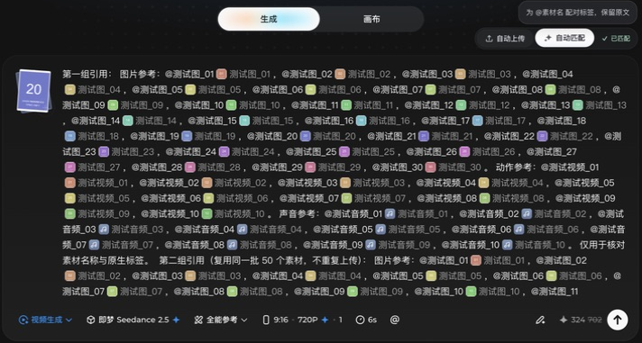

# 多素材与连续引用

**v0.3.17** · 2026-09-11 实测 · Chrome / 即梦国内站 / Seedance 2.5 / 全能参考。

[返回基础使用说明](../USER_GUIDE.md)

## 素材数量和引用次数

| 类型 | 官方附件上限 | 怎么上传 |
| --- | --- | --- |
| 图片 | 30 张 | 插件「自动上传」，选择包含三类素材的根文件夹。 |
| 视频 | 10 段 | 同上，支持子文件夹。 |
| 音频 | 10 段 | 同上，支持子文件夹。 |
| 合计 | 50 项 | 30 图 + 10 视频 + 10 音频。 |

来源：[ByteDance Seed 官方说明](https://seed.bytedance.com/en/blog/one-take-creation-flexible-referencing-introducing-seedance-2-5)。格式、尺寸、时长也须符合网页要求；其他模型以其页面提示为准。

**国际版也要选对模型。** 这套 50 素材示例适用于 Seedance 2.5；Dreamina Seedance 2.0 最多 9 图、3 视频、3 音频，且总数不超过 12 项，不能直接使用整套 50 素材。[2.0 官方说明](https://dreamina.capcut.com/tools/seedance-2-0)

**这些是附件上限。插件没有每轮 30 处或 50 处的匹配上限。** 同一素材在提示词中出现多次，只需上传一份，每处 `@素材名` 都会分别添加标签。比如上传 50 个素材，每个引用两次，就是 100 处匹配。

## 直接用本地文件测试

下载并解压源码项目，使用 [examples/mixed-names](../examples/mixed-names/README.md) 中的文件。扩展安装包只包含运行文件；测试素材在源码仓库中。

| `materials` 下的子目录 | 内容 |
| --- | --- |
| `01_图片_30张` | 30 张 PNG 编号卡片，分布在多个子目录。 |
| `02_视频_10段` | 10 段 768×768 MP4，每段约 2.1 秒。 |
| `03_音频_10段` | 10 段 WAV，每段约 2.1 秒，低音量测试音。 |

1. 空白视频任务选择 **Seedance 2.5 → 全能参考**。
2. 粘贴 [50 处完整提示词](../examples/mixed-names/prompt-50.txt)。
3. 点击「自动上传」，选择 **`examples/mixed-names/materials` 根文件夹**，允许浏览器访问。
4. 等提示「已提交：图片 30、视频 10、音频 10」，以及网页缩略图就绪。
5. 点击一次「自动匹配」，等待显示「已匹配」，检查原文后的原生标签。

**不要只选图片子目录。** 插件会递归寻找三类素材，只上传提示词精确引用的文件。同一文件不用反复上传。


提示词包含 `@角色 正面`、`@prop  backpack`、`@镜头 跟随`、`@音效（上升）`，以及 `7/70/700` 等相近编号。名称内部的空格、括号和下划线按文件名保留；只有带 `@` 的完整名称算引用。直接从 TXT 复制，下划线前不用添加反斜杠。

想先少量测试，可用基础指南的 [两张演示图](../examples/quick-start/README.md)。只测图片时，用 [30 图提示词](../examples/multi-assets/prompt-30-images.txt) 和 `images` 目录即可。

**名称要逐个写全**：`@测试图_01 到 30` 不会自动展开为三十处引用。测试提示词只用于核对名称，正式创作时请写清每个素材的角色、场景、动作或声音用途。

## 超过 50 处怎么匹配

保留刚才上传的 50 个素材，把输入框内容换成 [100 处引用提示词](../examples/mixed-names/prompt-100.txt) 或 [150 处引用提示词](../examples/mixed-names/prompt-150.txt)，再点击一次「自动匹配」。

两份提示词分别复用同一批素材两次、三次。插件会处理完整提示词；不用拆成 30 处一批，也不用重复上传。已配对的位置再次点击会跳过。

以下为历史 v0.3.16 的 100 处匹配截图，使用 [另一组编号素材](../examples/multi-assets/README.md)：



输入框有滚动区域，截图展示可见部分；该轮测试另逐项核对了全部 100 个标签。

## 测试结果

| 版本与检查项 | 结果 |
| --- | --- |
| v0.3.17：从根目录单次自动上传 | 提交 30 图 + 10 视频 + 10 音频，没有手动补加视频或音频。 |
| v0.3.17：十段、50 处复杂名称提示词 | 单击匹配完成，页面显示「已匹配」。 |
| v0.3.17：离线回归 | 50/100/150 处引用解析、混合上传、图片专用入口拒绝混合批次、仅补传缺失媒体通过。 |
| v0.3.16：同一批素材引用两次 | 单击完成 100 处，每个素材恰好 2 个标签，无未配对位置；再次点击仍为 100 个标签。 |
| v0.3.16：已有 30 图，再上传第 31 张 | 网页拒绝，提示「最多添加 30 个图片」。 |

v0.3.17 的 50 处完整流程已在真实网页测试；本目录的 100/150 处提示词完成了离线校验，尚未在该版本逐一完成网页实测。

历史 v0.3.16 的 100 处连续匹配约 **67.8 秒**，重复检查约 **1.3 秒**，不包含上传。耗时受页面响应、素材菜单和电脑负载影响。匹配已减少重复工具栏查找，只在检测到网页短暂回写时等待恢复。


测试还发现：512×512 视频被网页拒绝，提示分辨率不能低于 409600 像素；示例已改为 768×768 并通过上传。

## 文件与复测说明

- 更新扩展后，先在扩展管理页点击「重新加载」，再刷新即梦。刷新前保存提示词，附件若被清空则重新上传。
- 旧版只上传了图片时，先「自动匹配」核对已接收项，再 **Shift + 点击自动上传**重选包含全部文件的根目录，补传缺失媒体。
- 匹配期间先不要改字或切换任务。真实内容变化、缺少同名素材或候选结果无法确认时，仍会停止并提示；处理后再匹配即可。
- [编号素材的 `boundary` 目录](../examples/multi-assets/boundary) 另有第 31 张图片、第 11 段视频和第 11 段音频；本次只实测了第 31 张图片被拒绝，另外两项仅准备了文件。
- 示例均为教程制作的编号图、简单动画和测试音；没有使用私人素材，也没有提交视频生成任务。

无需运行代码即可使用文件。需要重新制作时，安装 Python、Pillow 和 FFmpeg，运行：

```sh
python3 examples/multi-assets/make-fixtures.py
```

脚本会覆盖同名测试素材，请在上传前运行。
